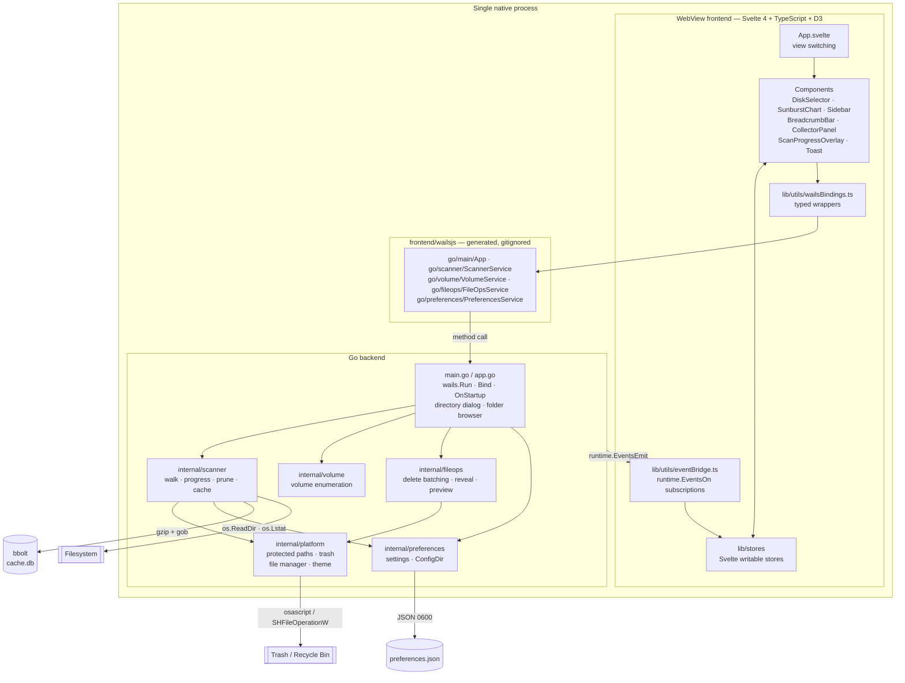

# Architecture

How ComputerPruner is put together, and why. This describes what is in the tree today — the disk
analyzer pillar — not what is planned. For the planned work see [roadmap.md](roadmap.md).

## The Wails process model

ComputerPruner is a [Wails v2](https://wails.io) application. That means one native process
containing two halves:

- A **Go backend** that does all the real work: walking the filesystem, enumerating volumes,
  deleting files, persisting settings.
- A **WebView frontend** — WKWebView on macOS, WebView2 on Windows — rendering a compiled Svelte
  4 and D3 bundle.

The frontend is not served over HTTP in a release build. `main.go` embeds the compiled bundle
with `//go:embed all:frontend/dist` and Wails' asset server hands it to the WebView from memory.
There is no port to bind, no localhost server, and no network activity of any kind.
(`frontend/dist/` is a build product and is gitignored, but an embed pattern that matches
nothing is a compile error, so a placeholder `frontend/dist/index.html` has to exist before the
root package will load. `./setup.sh` creates one, and CI's Go jobs seed the same file; it must
not be deleted.)

The two halves talk over Wails' binding bridge. Go structs listed in `Bind:` have their exported
methods reflected into generated TypeScript in `frontend/wailsjs/go/<package>/<Service>.js` and a
matching `.d.ts`. Calling `ScannerService.StartScan(path, false)` from TypeScript returns a
Promise that resolves when the Go method returns. Arguments and return values are marshalled as
JSON, which is why every struct crossing the boundary carries explicit JSON tags — those tags are
a contract with `frontend/src/lib/types/index.ts` and with the generated bindings, and renaming
one silently breaks the UI.

`frontend/wailsjs/` is generated and gitignored. `wails generate module` recreates it from the Go
service structs; CI does exactly that on the macOS and Windows runners before running
`svelte-check`, which is what catches drift between a renamed Go method and its TypeScript
caller.

Two important consequences of this model:

- **There is no privilege boundary between the halves.** Same process, same permissions, same
  trust domain. The bindings are a function call bridge, not a sandbox.
- **Wails cannot cross-compile.** A macOS `.app` must be built on macOS and a Windows `.exe` on
  Windows, which is why the release pipeline is a matrix of native runners and GoReleaser only
  archives what they produce.

### Startup wiring

`main.go` constructs four service instances plus the `App` struct, passes them all to `Bind:`,
and in `OnStartup` hands each service the Wails runtime context. Services keep that context
because emitting an event requires it; every service tolerates a nil context so that unit tests
and pre-startup calls do not panic (the real Wails emitter calls `log.Fatalf` when handed a
context that did not come from a lifecycle hook).

## Data flow

Two directions, and they are not symmetric.

**Frontend to backend: method calls.** A user action calls a wrapper in
`frontend/src/lib/utils/wailsBindings.ts`, which calls a generated binding, which invokes the Go
method. These are request/response and mostly return quickly. `StartScan` is the exception: it
validates its argument, spawns a goroutine, and returns immediately. The scan's actual results
never come back through the call.

**Backend to frontend: events.** Anything long-running or asynchronous is pushed with
`runtime.EventsEmit`. `frontend/src/lib/utils/eventBridge.ts` registers a handler per event on
mount and writes into Svelte stores; components are reactive over those stores and re-render
themselves. Nothing polls.

The event vocabulary is small and fixed:

| Event | Emitted by | Payload | Frontend effect |
| --- | --- | --- | --- |
| `scan:progress` | `ScannerService` | `ScanProgress` — items scanned, bytes accounted, current path, elapsed ms | Updates the progress overlay |
| `scan:complete` | `ScannerService` | the pruned `TreeNode` root | Stores the tree, sets the current root and breadcrumbs, clears the scanning flag, raises a success toast |
| `scan:error` | `ScannerService` | a message string | Clears the scanning flag, raises an error toast |
| `delete:progress` | `FileOpsService` | `DeleteProgress` — current, total, current path | Subscribed but currently unused |
| `delete:complete` | `FileOpsService` | `DeleteResult` — deleted count, freed bytes, errors | Raises a success or error toast summarising the batch |

`scan:progress` is throttled to one event per 200 visited entries. A whole-disk walk visits
millions of files; emitting per entry would drown the WebView in IPC and make the scan slower
than the disk.

### A scan, end to end

1. `DiskSelector` dispatches a scan request. `App.svelte` calls `startScan` for a volume mount
   point or `startFolderScan` for a folder; both reach the same internal function in Go.
2. `startScanInternal` takes the service lock, deals with any scan still in flight (below),
   increments the epoch, creates a cancellable context and a `done` channel, marks the service as
   scanning, and launches `runScan`.
3. `runScan` snapshots the user's settings — prune depth and exclusion set — once, so a
   mid-scan settings change cannot alter the meaning of the tree being built.
4. Unless the caller forced a rescan, the cache is consulted. A hit publishes the cached tree,
   emits `scan:complete` with a pruned copy, and returns.
5. Otherwise `scanDir` recurses. Each directory is split into path segments once and children are
   derived from the parent's segments, so a multi-million-entry walk does not re-parse a full path
   string per entry. Symlinks are skipped. Excluded subtrees are never opened. Progress is
   recorded per entry and emitted every 200.
6. The finished tree is published to the service (only if this scan is still the current epoch),
   saved to the cache on this same goroutine, and emitted — pruned — as `scan:complete`.

### The single-writer invariant

Exactly one scan goroutine may run at a time, and it owns the scan state for its whole life.

Every scan carries a monotonically increasing **epoch**. Every write to the shared tree, the
progress struct or the event stream first checks that the writer's epoch is still current; a
superseded goroutine's writes are dropped on the floor rather than corrupting the scan that
replaced it.

`CancelScan` only signals: it sets `cancelRequested` and calls the context's cancel function. It
deliberately does **not** clear the `scanning` flag — only the scan goroutine does that, as it
exits, via a deferred `finishScan`. `StartScan` arriving while a cancellation is in flight waits
on the previous goroutine's `done` channel (bounded at 30 seconds) before starting a new one.
That wait, not the epoch counter, is what guarantees there is only ever one writer; the epoch is
the belt to the channel's braces.

The `-race` flag in CI's test job exists for this code.

## The internal packages

### `internal/scanner`

Owns the walk, the tree, progress streaming, pruning and the cache.

`TreeNode` is the single data structure the whole application revolves around: name, path, size,
directory flag, protected flag, modification time, children, and recursive file and directory
counts. Its shape is the gob layout of the cache, so changing it means bumping the cache schema
version.

`paths.go` holds the containment primitives — `pathParts`, `pathSet`, `exclusionSet` — all of
which compare whole path segments rather than raw string prefixes, for the same reason the
protected-path guard does. `pathSet` lets the walk answer "is this one of the protected roots?"
with a map lookup instead of a linear scan of the protected list per entry.

Symlinks are counted as visited but never followed and contribute zero bytes. Following them
makes the walk unsound: a link to an ancestor turns the tree into a cycle, and even acyclic links
cause the same bytes to be counted under several parents. For a tool whose output drives deletion
decisions, over-reporting reclaimable space in a directory that does not own it is the worse
failure. Proper deduplication would need device-and-inode identity tracking, which does not exist
in the same form on Windows.

### `internal/volume`

Enumerates mounted volumes and reports capacity. `volume.go` holds the portable types, the
service facade and the pure helpers (display-name construction, drive-root normalisation, the
clamped used-bytes arithmetic, UTF-16 multi-string splitting); the build-tagged files supply two
unexported entry points, `listVolumes` and `statVolume`. macOS enumerates `/` and `/Volumes/*`
via `statfs(2)`; Windows uses `GetLogicalDriveStrings` and `GetDiskFreeSpaceEx` through
`golang.org/x/sys/windows`.

### `internal/fileops`

The destructive half. `DeletePaths` trashes, `DeletePathsPermanently` removes. Both funnel
through `deleteBatch`, which validates **every** path in the request against the protected-path
guard before destroying any of them, so a rejection late in the list cannot be preceded by files
that are already gone — and then re-validates each survivor immediately before destroying it, so
no path is acted on with a verdict that is several deletes old. Rejections are returned as
strings in `DeleteResult.Errors` rather than aborting the batch. The remaining
time-of-check/time-of-use window is documented under "Known limitations" in
[SECURITY.md](../SECURITY.md).

The guard and both destructive primitives are indirected through package-level variables
(`checkProtected`, `moveToTrash`, `removeAll`) so a unit test can prove that a protected path is
skipped without touching a real file. Production code never reassigns them.

### `internal/platform`

Every OS-specific behaviour, and the safety policy.

`protected_paths.go` is the pure, tag-free core: builders that take the home directory (and, on
Windows, an environment lookup function) as parameters and return fully resolved absolute entries
with no `~` in them. Keeping them free of build tags and of direct `os.*` calls is what makes the
"no tilde ever escapes into the delete guard" property testable for every target OS from one
host.

Each entry carries a **depth**, which is how far the protection reaches:

| Depth | Meaning | Examples |
| --- | --- | --- |
| `depthSubtree` | the entry and everything under it | `/System`, `/usr`, `%ProgramFiles%` |
| `depthEntryAndChildren` | the entry and its immediate children | `/Users`, `/Volumes`, `%SystemDrive%\Users` |
| `depthEntryOnly` | just the directory itself | the home directory, `~/Documents`, `%LOCALAPPDATA%` |

A blanket subtree rule cannot be applied to everything: on macOS every user file lives under
`/Users`, so a blanket rule would refuse every delete the application exists to perform. The
depth distinction is what lets `~/Downloads` be undeletable while its contents remain the point
of the tool.

Two things are layered on top of the raw lists by `finaliseEntries`:

- **Ancestor synthesis.** Every ancestor of every entry is added at `depthEntryOnly`. Depth does
  not propagate upwards, so without this, protecting `~/Library/Application Support` left
  `~/Library` — Keychains, Mail, Messages and all — deletable in a single call.
- **A wildcard segment.** An entry path may contain `*`, which matches any single segment. It is
  used at exactly one position, immediately below a users or volumes root, so that
  `/Users/*/Documents` guards every account rather than only the one the process is running as,
  and `/Volumes/*/System` guards a mounted system clone. Matchers are allowed to rely on the
  single-position rule; `platform.WildcardSegment` is exported for that purpose.

`platform.go` holds `IsProtected` and the comparison machinery. It fails closed on anything it
cannot confidently classify, resolves symlinks (walking up through however many components are
missing, which catches an ancestor symlink into a protected tree), canonicalises Windows volume
spellings, folds segments to NFC, and compares whole segments with `.` and `..` normalised.
`containDepth`, `matchDepthSep`, `isAbsSep` and `refuseOnSyntax` are all parameterised on
separator and case sensitivity so the Windows and POSIX rules are both exercised from a single
test host. `internal/platform/protected_bypass_test.go` is the regression suite; each test in it
fails if you revert the fix it covers.

`ProtectedEntries()` exports the paths *with their depths*. The scanner consumes it to build
`protectionMatcher` (`internal/scanner/paths.go`), which is what decides whether the UI shows a
shield. Before that existed, the scanner matched protected paths exactly and threw the depths
away, so the badge and the delete policy disagreed in both directions.
`TestProtectionMatcherAgreesWithTheDeleteGuard` pins them together.

### `internal/preferences`

Settings persistence, and the single decision about where on-disk state lives. `ConfigDir()` is
the only function allowed to answer that question — preferences and the cache used to disagree,
with preferences hard-coding `$HOME/.config` while the cache used `os.UserConfigDir`, which is
two different directories on macOS and simply wrong on Windows.

Values are normalised on both read and write, so a hand-edited `preferences.json` cannot ask for
a scan depth of one billion or an exclusion path the scanner could not act on.

## Build-tag layout

| Package | Files | Tags |
| --- | --- | --- |
| `internal/platform` | `platform.go`, `protected_paths.go`, `applescript.go` | none — portable |
| | `platform_darwin.go` | `darwin` |
| | `platform_windows.go`, `trash_windows.go` | `windows` |
| | `platform_other.go` | `!darwin && !windows` |
| `internal/volume` | `volume.go` | none — portable |
| | `volume_darwin.go` | `darwin` |
| | `volume_windows.go` | `windows` |
| | `volume_other.go` | `!darwin && !windows` |
| `internal/scanner` | `paths_caseinsensitive.go` | `darwin \|\| windows` |
| | `paths_casesensitive.go` | `!darwin && !windows` |

`trash_windows.go` takes its tag from the filename suffix as well as an explicit `//go:build
windows` line; `applescript.go` deliberately has **no** tag despite being macOS-specific, because
the escaping logic is pure string manipulation and is unit-tested on every platform.

Each tagged set supplies an identical API. On `internal/platform` that is `MoveToTrash`,
`RevealInFileManager`, `PreviewFile`, `GetSystemTheme`, the unexported `platformProtectedPaths`,
and the `pathsAreCaseInsensitive` constant. On `internal/volume` it is `listVolumes` and
`statVolume`. Vetting both `GOOS=darwin` and `GOOS=windows` is what keeps them in step; a
single-GOOS vet would leave half the tree unchecked.

The `_other` files exist so the tree compiles, vets and runs its test suite on Linux, which is
where three of CI's five jobs run and where most contributors will run `go test`. ComputerPruner
does not ship for Linux. The fallbacks are best-effort and fail closed: `platform_other.go`
refuses to trash a file when the `gio` helper is missing rather than quietly deleting it
permanently, and `volume_other.go` returns no volumes rather than guessing at `/proc/mounts`.

## The caching layer

A whole-disk scan takes minutes. Reopening a volume you scanned an hour ago should not.

The cache is a [bbolt](https://github.com/etcd-io/bbolt) database at `<ConfigDir>/cache.db`,
opened mode `0600` with a two-second lock timeout so a second instance of the app runs without a
cache instead of blocking forever. A single bucket, `scans`, maps a scan root to a compressed
snapshot.

**Encoding.** A `ScanSnapshot` — a timestamp plus the root `TreeNode` — is `gob`-encoded into a
`gzip` writer. `gob` because the payload is a deeply recursive Go struct with millions of nodes
and JSON would be several times larger and slower; `gzip` because directory trees are extremely
repetitive and compress by a large factor.

**The schema-version key.** `cacheSchemaVersion` is a constant, currently `2`, and every key is
prefixed `v<N>\x00` followed by the scan root. Two things follow. A build with a newer schema
simply never looks up an older entry, so a stale gob layout can never reach a decoder whose
struct no longer matches it — which is the failure that used to panic the decoder. And on open,
`dropForeignSchemas` walks the bucket and deletes anything not carrying the current prefix, so
the file does not grow without bound across upgrades. **Bump the constant whenever `TreeNode` or
`ScanSnapshot` changes shape.** Version 1 was the unversioned layout keyed by bare path.

**Reading is defensive.** Entries are capped at 64 MiB compressed and 256 MiB decoded.
Decompression runs through a `cappedReader` that returns an error at the cap rather than a clean
EOF, because `io.LimitReader`'s EOF looks to a decoder like a valid short stream. The decode is
wrapped in a `recover`, since `gob` is not hardened against malformed input. Entries are given a
24-hour TTL.

**Every failure degrades to "no cache".** A missing, expired, oversized, truncated or undecodable
entry returns `(nil, nil)`, not an error; a bad entry is deleted so the next scan repopulates it.
The error return is reserved for problems with the database itself. If the cache cannot be opened
at all the scanner runs without one. Nothing about the cache can prevent a scan.

## Tree pruning

The scanner keeps the **complete** tree in memory. It sends the frontend a pruned copy.

This matters because a home directory can hold a million files and the sunburst is an SVG. Handing
a million-node tree across the JSON binding boundary and asking D3 to lay it out produces a
multi-second freeze and a chart nobody can read — most arcs would be sub-pixel.

`pruneTree` produces a new tree (the original is never modified) under three rules applied at
every level:

1. **Depth cap.** Recursion stops at the user's `ScanDepthLimit`, clamped to `[1, 64]` with a
   default of 8. A node at the cap keeps its own size and counts but is emitted with no children,
   so the totals stay correct even though the detail is gone.
2. **Children cap.** Children are sorted by size descending and at most 80 per node are kept. A
   sunburst ring with more segments than that is unreadable and unclickable.
3. **Size floor.** A child smaller than half a percent (0.005) of its parent is dropped from the
   kept set regardless of position. Below that fraction an arc is a sliver.

Everything excluded by rules 2 and 3 is not discarded — it is accumulated into one synthetic
`(other small items)` node, carrying the summed size and the summed file and directory counts,
with a path of `<parent>/<other>`. So every ring still adds up to its parent's size, and the user
can see how much is hiding in the tail.

The full tree stays in `ScannerService.scanTree` and is reachable through `GetScanTree()`, which
is the foundation for lazily fetching detail when a user drills into a collapsed branch.

## Frontend structure

`frontend/src/lib/stores/` holds Svelte writable stores — the scan tree, the current root, the
breadcrumb trail, scan progress, the collector list, notifications, theme. Components read them
reactively and never talk to the backend for state that an event already provides.

`frontend/src/lib/utils/` holds the boundary code: `wailsBindings.ts` wraps every generated
binding in a typed function so the rest of the app imports from one place;
`eventBridge.ts` registers the five event handlers exactly once on mount; `format.ts` and
`colorScale.ts` are pure presentation helpers.

`frontend/src/lib/types/index.ts` mirrors the Go structs. It is hand-written and must be kept in
step with the JSON tags on the Go side; `svelte-check` running after `wails generate module` in
the CI build job is what catches drift.

Theming is CSS custom properties defined in `app.css`, dark by default. Components must not
hardcode colours.

## Known limitations and accepted risks

Security-relevant limitations live in [SECURITY.md](../SECURITY.md) under "Known limitations".
The ones below are build, packaging and repository-hygiene decisions that were considered and
deliberately not changed. They are recorded here so nobody spends an afternoon rediscovering
them.

### `frontend/dist/` is gitignored, and three CI jobs seed a placeholder

`main.go` carries `//go:embed all:frontend/dist`. An embed pattern that matches nothing is a
*compile* error, so on a fresh clone `go build ./...`, `go vet ./...`, `gopls` and
`wails generate module` all fail before reading a line of Go. Three CI jobs (`lint-go`,
`govulncheck`, `build`) therefore each carry a "Seed frontend/dist placeholder" step, and
`setup.sh` does the same for a local clone.

Committing `frontend/dist/.gitkeep` and negating it in `.gitignore` would remove the
triplication. It was rejected: `vite.config.ts` sets `emptyOutDir: true`, so every local
`npm run build` would delete the tracked placeholder and leave a dirty working tree — trading
three duplicated CI steps for a permanent papercut on every contributor's machine. The
duplication is the lesser cost. If you touch one seed step, touch all three.

### The first release will have a broken "compare" link

`.github/release-drafter.yml` renders a `…/compare/$PREVIOUS_TAG...$RESOLVED_VERSION` link.
`$PREVIOUS_TAG` is empty until a second release exists, so the very first release notes carry a
link ending in `/compare/...v0.1.0`. Release Drafter's templates have no conditionals, so the
only fixes are to drop the link entirely or to hand-edit the first draft. It self-heals from the
second release onwards.

### GitHub Discussions must be enabled before the repository is made public

`.github/ISSUE_TEMPLATE/config.yml` sets `blank_issues_enabled: false` — deliberately, because
the bug form carries the "no private paths" privacy acknowledgement that a blank issue would
bypass — and points anyone with a question at Discussions. If Discussions is not enabled, that
link 404s and a user with a question has no route at all. **Enable Discussions as part of
publishing the repository.**

### `npm audit` reports four moderate advisories

All four are the Svelte 4 SSR XSS chain (`svelte` → `svelte-hmr` →
`@sveltejs/vite-plugin-svelte`). The only remedy npm offers is a breaking bump to Svelte 5, which
is not the stack this project is on. ComputerPruner never server-side-renders — the bundle is
compiled at build time and served from Go's embedded filesystem — so none of them is reachable.
The CI step runs at `--audit-level=moderate` (so the advisories actually surface as an
annotation) and is `continue-on-error`.

### No macOS or Windows binary has been produced or verified in CI's linting environment

`wails build`, `wails dev` and `wails doctor` need a macOS or Windows host plus CGO and a
platform WebView. The release workflow runs them on real runners; the lint, test and vulnerability
jobs cannot. Everything those jobs check is either pure Go or `go vet` cross-compilation for
`darwin/arm64`, `windows/amd64` and `windows/arm64`.
